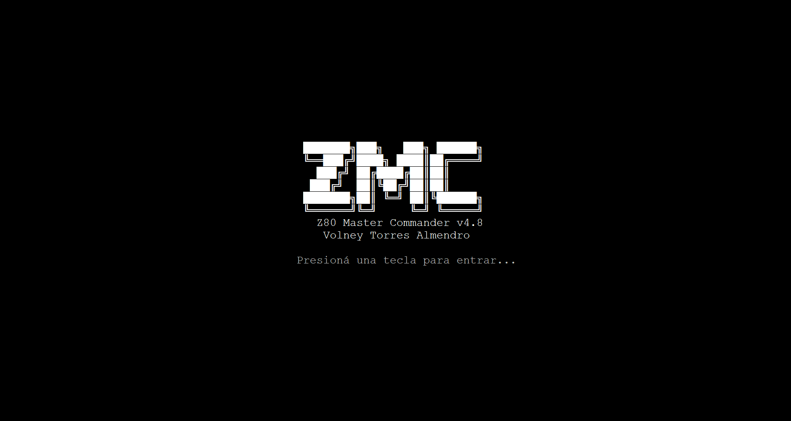
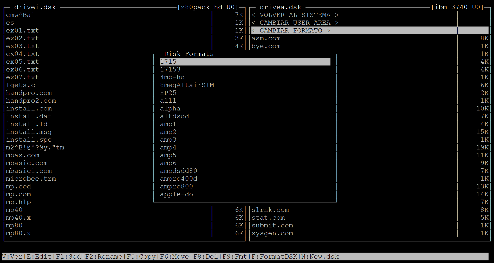

# Z80 Master Commander (ZMC) v4.8 - "Midnight Edition"

**Z80 Master Commander** es un administrador de archivos de doble panel inspirado en Midnight Commander, diseñado específicamente para gestionar imágenes de disco CP/M (`.dsk`) en entornos Linux/Ubuntu, optimizado para sesiones SSH/Putty.

Desarrollado en Python con la librería `curses`, permite una gestión ágil de archivos entre el sistema host (Linux) y los sistemas de archivos retro, con una estética fiel al mítico MC.

> **Atención:** Sistema en desarrollo. Extremadamente útil para gestionar archivos en imágenes de disco CP/M, pero se recomienda siempre tener respaldos de sus imágenes `.dsk`.

## Novedades v4.8
- **Estética MC Real**: Paneles con separadores verticales y visualización de tamaños de archivos alineados.
- **Gestión de Tamaños**: Visualización del peso real de los archivos internos del disco (en KB).
- **Blindaje de Sesión**: Recuperación automática de la terminal (`stty sane`) tras usar editores o visores externos.

## Características Principales
- **Doble Panel**: Navegación intuitiva entre directorios locales y archivos de imagen de disco.
- **Soporte CP/M Pro**: Gestión completa de **User Areas (U0-U15)** y selección de geometrías de disco (F9).
- **Operaciones en Bloque**: Selección múltiple de archivos con `INSERT` o `Espacio` para copiar, mover o borrar.
- **Herramientas Integradas**:
  - **Fsed (F1 / s)**: Edición de sectores directamente en el disco.
  - **Format (F)**: Formateo físico de imágenes de disco (`mkfs.cpm`).
  - **Edit/View (F4/F3)**: Integración nativa con `mcedit` y `mcview`.

## Mapa de Teclas
| Tecla | Acción |
|-------|--------|
| **Tab** | Cambiar entre panel izquierdo y derecho |
| **Enter** | Entrar en directorio o abrir imagen `.dsk` |
| **INS / Espacio** | Marcar/Desmarcar archivo (Selección múltiple) |
| **F1 / s** | Abrir editor de sectores (`fsed.cpm`) |
| **F3 / v** | Ver archivo (`mcview`) |
| **F4 / e** | Editar archivo (`mcedit`) |
| **F5 / c** | Copiar archivos marcados |
| **F6 / m** | Mover archivos marcados |
| **F8 / d** | Borrar archivos marcados (con confirmación) |
| **F9** | Cambiar formato de disco (Diskdef) |
| **f** | Formatear disco completo (mkfs.cpm) |
| **n** | Crear nueva imagen `.dsk` vacía |
| **F10 / q** | Salir del programa |

## Instalación
Requiere `cpmtools` y `mc` instalados en Linux.

1. Clona el repositorio:
   `git clone https://github.com/lu1pvt/z80-master-commander.git`
2. Configurá tus rutas en `config.py`.
3. Ejecutá: `python3 zmc.py`.

---
*Desarrollado por lu1pvt - 2026. ¡Gracias!*
